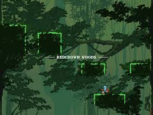

# SFML-game

**SFML-game** is a 2D platformer game inspired by [Jump King](https://www.jump-king.com), built with [SFML](https://www.sfml-dev.org/).

## Screenshot



---

## Building

This project uses [CMake](https://cmake.org/) to configure and build the game. Dependencies are handled automatically with CMake `FetchContent` where possible.

1. Clone the repository:
    ```bash
   git clone https://github.com/JorisDV/SFML-game.git
   cd SFML-game
   ```
2. Install dependencies (Linux only)

   On Linux, some system dependencies must be installed manually before building.

   Required system libraries:
   - X11
   - Xrandr
   - Xcursor
   - Xi
   - Udev
   - OpenGL
   - pthread
   
   On Ubuntu and other Debian-based distributions you can use the following command to install them:
      ```bash
      sudo apt install \
          libxrandr-dev \
          libxcursor-dev \
          libxi-dev \
          libudev-dev \
          libfreetype-dev \
          libflac-dev \
          libvorbis-dev \
          libgl1-mesa-dev \
          libegl1-mesa-dev \
          libfreetype-dev
      ```
   
3. Configure and build:
    ```bash
   cmake -B build
   cmake --build build
   ```

## License
This project is licensed under the [MIT License](https://opensource.org/license/mit).